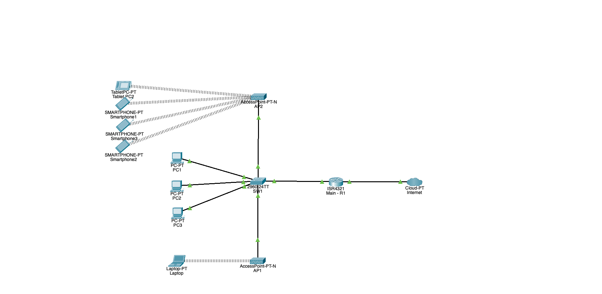

# SOHO VLAN Segmentation

### Project Description
I used Cisco Packet Tracer to build a secure Small Office/Home Office (SOHO) network that demonstrates proper VLAN segmentation, routing, and basic security controls. I designed this lab to practice CCNA-level networking skills and to showcase network design and implementation for prospective employers.

### Objectives
- I designed a logically segmented network using VLANs
- I configured trunking between switches and set up a native VLAN
- I implemented DHCP for IP address management
- I applied port security, switch hardening, and SNMP/storm control
- I established inter-VLAN routing with a router-on-a-stick

### Skills & Tools Used
- Cisco Packet Tracer
- VLAN configuration (10, 20, 180, 99)
- 802.1Q trunking & native VLAN
- Router-on-a-Stick configuration
- DHCP server setup
- SNMP & storm control
- Basic ACLs and port security
- Networking concepts covered in the CCNA

### Network Diagram


The network consists of four VLANs:

| VLAN | Purpose       | Subnet          | Gateway IP        |
|------|---------------|-----------------|-------------------|
| 10   | Admin Devices | 192.168.10.0/24 | 192.168.10.254    |
| 20   | Guest Network | 192.168.20.0/24 | 192.168.20.254    |
| 180  | Wireless APs  | 192.168.180.0/24 | 192.168.180.254   |
| 99   | Native VLAN   | 192.168.99.0/24 | 192.168.99.254    |

### Configuration Steps
```
# Configure VLANs on SW1
conf t
vlan 10
 name Admin_Devices
vlan 20
 name Guest_Network
vlan 180
 name Wireless_APs
vlan 99
 name Native

# Configure trunk port on SW1
interface Gig0/0/1
 switchport mode trunk
 switchport trunk native vlan 99
 switchport trunk allowed vlan 10,20,180

# Router-on-a-Stick subinterfaces on R1
interface Gig0/0.10
 encapsulation dot1q 10
 ip address 192.168.10.254 255.255.255.0

interface Gig0/0.20
 encapsulation dot1q 20
 ip address 192.168.20.254 255.255.255.0

interface Gig0/0.180
 encapsulation dot1q 180
 ip address 192.168.180.254 255.255.255.0
...
```

### Results & Testing
- Verified inter-VLAN routing using ping tests between VLANs via router-on-a-stick.
- Confirmed DHCP scopes deliver correct IP addresses to devices in each VLAN.
- Tested port security violations; restricted ports shut down upon violation.
- Used SNMP and storm control features to monitor network performance and suppress unusual traffic patterns.

### Future Improvements
- Integrate a wireless controller for centralized management.
- Implement AAA with RADIUS/TACACS for secure authentication.
- Explore redundant links and STP for higher availability.
